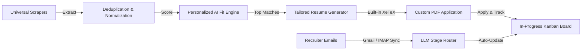

# JobOps: The Open-Source AI Job Search & Application Command Center

<a href="https://trendshift.io/repositories/22756" target="_blank"></a>

[](https://github.com/DaKheera47/job-ops)
[](https://github.com/DaKheera47/job-ops/pkgs/container/job-ops)
[](https://github.com/DaKheera47/job-ops/releases)
[](https://github.com/DaKheera47/job-ops/actions)
[](https://try.jobops.app?utm_source=github&utm_medium=badge&utm_campaign=waitlist)


**Stop applying blind.** 

**JobOps** is a self-hosted, multi-tenant AI command center for software engineers and knowledge workers. It crawls major job boards, extracts listings with anti-bot defenses, scores suitability against your profile using modern LLMs, tailors resume bullet points, generates production-grade PDFs with an embedded LaTeX compiler, and automatically detects interview invites and rejections directly from your email.

---

## Table of Contents

- [Core Capabilities](#core-capabilities)
- [Architecture & Multi-Tenancy](#architecture--multi-tenancy)
- [Live Demo & Screenshots](#live-demo--screenshots)
- [Quick Start Guide](#quick-start-guide)
  - [1. Universal Droplet / VPS Deployment (`deploy.sh`)](#1-universal-droplet--vps-deployment-deploysh)
  - [2. Docker Compose](#2-docker-compose)
  - [3. Heroku Container Deployment](#3-heroku-container-deployment)
  - [4. Local Development](#4-local-development)
- [Supported Job Boards & Extractors](#supported-job-boards--extractors)
- [Post-Application Tracking & Ingestion](#post-application-tracking--ingestion)
- [Resume Tailoring & LaTeX Exporter](#resume-tailoring--latex-exporter)
- [Model Context Protocol (MCP) Server](#model-context-protocol-mcp-server)
- [Configuration & Environment Reference](#configuration--environment-reference)
- [Development & CI Verification](#development--ci-verification)
- [Contributing & License](#contributing--license)

---

## Core Capabilities



1. **Autonomous & Scheduled Sourcing**: Scrapes 10+ major job boards on custom schedules (hourly/daily cron) or through natural language search prompts.
2. **True Multi-Tenancy Isolation**: Every user owns their private pipeline schedules, search schedules, saved jobs, tailored resumes, email integrations, and configs.
3. **Personalized LLM Fit Scoring**: Compares JD text against your profile and work experience to produce 0–100 suitability scores, match verdicts, and gap analysis.
4. **Built-in LaTeX Resume Compiler**: Generates custom PDF resumes for every job using bundled XeTeX/Tectonic toolchains. No external SaaS required.
5. **Smart Inbox Router**: Connects to Gmail or IMAP to classify recruiter responses (Interview Invites, Offers, Rejections, Updates) and advances board stages automatically.
6. **Anti-Detection Crawl Engine**: Camoufox fingerprint spoofing, browser pool management, and Cloudflare/Bot-detection circumvention.
7. **Tracer Links**: Embeds click-tracking analytics tokens in resumes to notify you the exact moment a recruiter opens your links.

---

## Architecture & Multi-Tenancy

JobOps is engineered as a hardened, full-stack monorepo:

- **Frontend**: React 18, Vite, TailwindCSS / Radix UI, TanStack Query, Lucide icons.
- **Backend API**: Express TypeScript server with structured JSON logging (`infra/logger.ts`), request correlation IDs (`x-request-id`), and strict sanitization.
- **Database Layer**: SQLite with Write-Ahead Logging (WAL mode), `busy_timeout` handling, schema migrations via Drizzle ORM, and per-user index partitioning.
- **Async Request Context**: Every pipeline execution, background scan, and HTTP request propagates `userId` through `AsyncLocalStorage` to guarantee strict multi-tenant isolation.
- **Sidecars & Workers**: Python 3.12 Playwright scraper suite, Camoufox browser instances, and a FastAPI Browser-Use AI sidecar.

---

## Live Demo & Screenshots

<details>
<summary><b>🎬 Pipeline Run Demo: Crawl -> Score -> Tailor</b></summary>

https://github.com/user-attachments/assets/5b9157a9-13b0-4ec6-9bd2-a39dbc2b11c5

</details>

<details>
<summary><b>🎬 Apply & Email Tracking Demo</b></summary>

https://github.com/user-attachments/assets/06e5e782-47f5-42d0-8b28-b89102d7ea1b

</details>

---

## Quick Start Guide

### 1. Universal Droplet / VPS Deployment (`deploy.sh`)

Deploy directly to an Ubuntu 22.04/24.04 server (DigitalOcean, Hetzner, AWS EC2, Linode) in a single command:

```bash
# Clone the repository locally
git clone https://github.com/DaKheera47/job-ops.git
cd job-ops

# Deploy to your remote server IP
./deploy.sh <YOUR_SERVER_IP>
```

`deploy.sh` automatically:
- Provisions swap space, Node.js 22 LTS, PM2, Python 3, Nginx, and XeTeX tools.
- Syncs the codebase and runs database migrations.
- Configures PM2 process daemonization and Nginx reverse proxying on Port 80.
- Runs live endpoint health checks.

---

### 2. Docker Compose

Run locally or on any Docker-compatible host:

```bash
# Clone and enter directory
git clone https://github.com/DaKheera47/job-ops.git
cd job-ops

# Copy and configure environment variables
cp .env.example .env

# Launch all services in background
docker compose up -d

# Open dashboard
open http://localhost:3005
```

---

### 3. Heroku Container Deployment

JobOps includes a production `heroku.yml` and `Dockerfile.heroku`:

```bash
# Log in and create container app
heroku login
heroku create job-ops-app --stack container

# Set secure session secret and environment
heroku config:set SESSION_SECRET="$(openssl rand -hex 32)" NODE_ENV=production

# Deploy to Heroku
git push heroku main
```

---

### 4. Local Development

```bash
# Install dependencies
npm install

# Start development servers (Server + Vite Client)
npm run dev

# Open http://localhost:5173
```

---

## Supported Job Boards & Extractors

| Platform | Source Identifier | Type | Authentication / API Key | Location Support |
|---|---|---|---|---|
| **LinkedIn** | `linkedin` | Playwright / HTML | Optional Cookie | Global |
| **Indeed** | `indeed` | Python JobSpy | Not Required | Global |
| **Glassdoor** | `glassdoor` | Python JobSpy | Not Required | Global |
| **Adzuna** | `adzuna` | REST API | `ADZUNA_APP_ID`, `ADZUNA_APP_KEY` | US, UK, CA, AU, EU, IN |
| **Hiring Cafe** | `hiringcafe` | JSON API | Not Required | Global / Remote |
| **startup.jobs** | `startupjobs` | HTML Extractor | Not Required | Global Remote |
| **Working Nomads** | `workingnomads`| JSON API | Not Required | Remote Curated |
| **Gradcracker** | `gradcracker` | HTML Extractor | Not Required | UK / STEM |
| **UK Visa Jobs** | `ukvisajobs` | Sponsorship API | Not Required | UK Sponsored Roles |
| **USAJOBS** | `usajobs` | REST API | `USAJOBS_API_KEY` | US Federal |

---

## Post-Application Tracking & Ingestion

JobOps solves the black hole of job hunting with an automated email routing engine:

1. **Integration Setup**: Connect your Gmail account via OAuth (or configure IMAP in Settings).
2. **Periodic Scanning**: Background sync runs inspect unread messages from recruiters and applicant tracking systems (Workday, Greenhouse, Lever, Ashby).
3. **LLM Classification**: Analyzes email context against your applied jobs to classify:
   - 🟢 **Interview Invites**: Automatically moves job to *Interviewing* and captures event details.
   - 🔴 **Rejections**: Automatically archives job and updates response metrics.
   - 🟡 **Offers & Updates**: Alerts you on the dashboard and prompts for action.

---

## Resume Tailoring & LaTeX Exporter

- **Built-in XeTeX Engine**: Compiles beautiful, single-page LaTeX resumes without installing third-party desktop tools.
- **Targeted Bullet Generation**: The AI analyzes the job description's core requirements and synthesizes achievements from your profile into high-impact bullet points.
- **Reactive Resume Integration**: Seamlessly import existing JSON resumes from RxResume v4.

---

## Model Context Protocol (MCP) Server

JobOps includes a standard **Model Context Protocol (MCP)** server, enabling Claude Desktop, Cursor, and AI agents to query jobs, trigger pipelines, and inspect applications:

```json
{
  "mcpServers": {
    "job-ops": {
      "command": "node",
      "args": ["/path/to/job-ops/orchestrator/dist/server/mcp/cli.js"]
    }
  }
}
```

### Supported MCP Tools
- `search_jobs`: Query discovered jobs with multi-parameter filtering.
- `trigger_pipeline`: Launch automated crawl and scoring runs.
- `get_application_status`: Retrieve pipeline and interview status.
- `tailor_resume`: Generate customized resume content for specific roles.

---

## Configuration & Environment Reference

| Variable | Default | Description |
|---|---|---|
| `PORT` | `3001` | Backend HTTP listening port |
| `NODE_ENV` | `development` | Runtime mode (`development` or `production`) |
| `AUTH_MODE` | *(unset)* | Set to `session` for multi-user deployments: unauthenticated `/api` and `/mcp` requests are rejected with 401 instead of running as a shared anonymous tenant |
| `DATA_DIR` | `./data` | Directory for SQLite database (`jobs.db`) and file assets |
| `SESSION_SECRET` | *(auto-generated)* | 32+ character hex string for signing session tokens |
| `EXTRACTOR_RUN_TIMEOUT_MS` | `600000` | Hard timeout per extractor run (pipelines and searches) |
| `PIPELINE_MAX_GLOBAL_RUNS` | `12` | Process-wide ceiling on concurrently running pipelines across all users |
| `OPENAI_API_KEY` | - | API key for OpenAI model completions |
| `OPENROUTER_API_KEY` | - | API key for OpenRouter multi-model routing |
| `GEMINI_API_KEY` | - | API key for Google Gemini Flash / Pro models |
| `GMAIL_CLIENT_ID` | - | Google Cloud OAuth Client ID for Gmail tracking |
| `GMAIL_CLIENT_SECRET`| - | Google Cloud OAuth Client Secret |
| `ADZUNA_APP_ID` | - | Adzuna developer API App ID |
| `ADZUNA_APP_KEY` | - | Adzuna developer API Key |
| `USAJOBS_API_KEY` | - | USAJOBS API authentication key |

---

## Development & CI Verification

Run the full CI-parity check suite locally before submitting changes:

```bash
# 1. Biome Linter & Code Formatter
npm run check:all

# 2. Workspace Type Checking
npm run check:types

# 3. Production Client Build
npm --workspace orchestrator run build:client

# 4. Comprehensive Vitest Test Suite (216 test files)
npm --workspace orchestrator run test:run

# 5. Documentation Build
npm run docs:build
```

---

## Contributing & License

We welcome community contributions! Please read [`CONTRIBUTING.md`](./CONTRIBUTING.md) for pull request guidelines and coding standards.

### License

**AGPLv3 + Commons Clause** — You are free to self-host, modify, and run JobOps for personal or organizational use. Commercial redistribution or offering paid hosted services based substantially on JobOps requires written permission. See [LICENSE](LICENSE).
