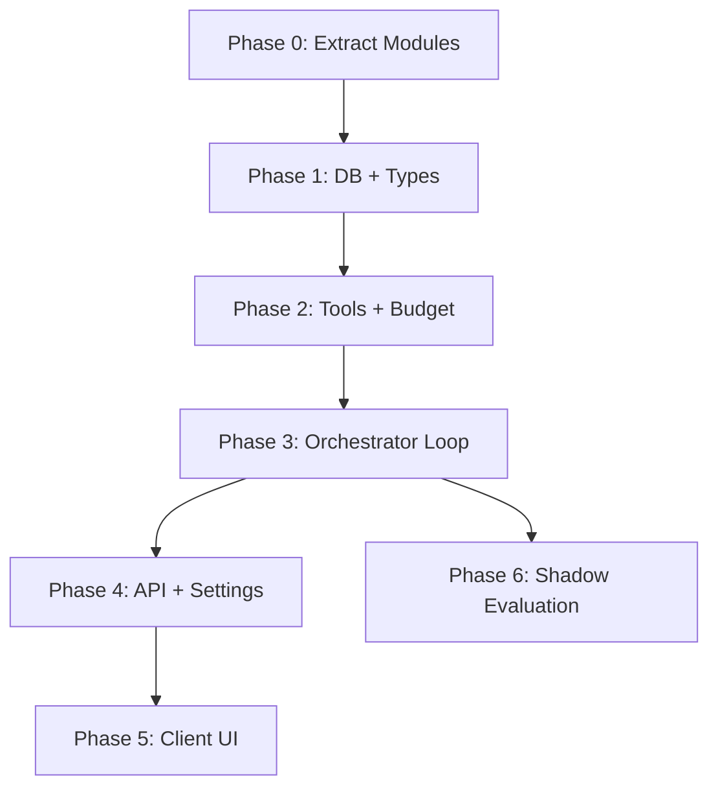

# Implementation Plan — Agentic Search Orchestrator V1

> Concrete, file-level plan that maps to the existing codebase. Each phase is independently shippable.

---

## Phase 0: Pure Refactor — Extract Reusable Modules (No Behavior Change)

**Goal:** Make existing search internals importable by the agentic orchestrator without modifying any behavior.

### Changes

#### [MODIFY] [orchestrator.ts](file:///Users/venkatasai/untitled%20folder/job-ops/orchestrator/src/server/services/job-search/orchestrator.ts)

- Extract `runSource()` (lines 66-140) → new file `source-runner.ts`
- Extract `resolveSources()` (lines 52-61) → new file `source-resolver.ts`
- Update imports in `orchestrator.ts` to use new modules
- `executeJobSearch()` behavior is **unchanged**

#### [NEW] `orchestrator/src/server/services/job-search/source-runner.ts`

```typescript
export async function runSource(
  source: string,
  spec: ParsedSearchSpec,
  existingJobUrls: Promise<string[]>,
): Promise<{ source: string; jobs: CreateJobInput[]; error: string | null }>
```

#### [NEW] `orchestrator/src/server/services/job-search/source-resolver.ts`

```typescript
export async function resolveSources(
  spec: ParsedSearchSpec,
): Promise<{ sources: string[]; availableSources: string[] }>
```

#### [MODIFY] [index.ts](file:///Users/venkatasai/untitled%20folder/job-ops/orchestrator/src/server/services/job-search/index.ts)

- Re-export new modules so existing imports don't break

### Verification

```bash
npm --workspace orchestrator run check:types
npm --workspace orchestrator run test:run
# Existing job-search tests must pass with zero changes
```

---

## Phase 1: Database Schema + Repository + Types

**Goal:** Add agentic search tables and types without any runtime behavior change.

### Changes

#### [MODIFY] [schema.ts](file:///Users/venkatasai/untitled%20folder/job-ops/orchestrator/src/server/db/schema.ts)

Add three new tables after the existing `jobSearches` table:

```typescript
// --- Agentic Search tables ---

export const AGENTIC_SEARCH_STATUSES = [
  "created", "planning", "searching", "normalizing",
  "deduplicating", "filtering", "evaluating", "verifying",
  "refining", "ranking", "reporting", "completed",
  "failed", "partial", "cancelled", "timed_out",
] as const;

export const agenticSearches = sqliteTable(
  "agentic_searches",
  {
    id: text("id").primaryKey(),
    userId: text("user_id").notNull().default("default-user"),
    originalQuery: text("original_query").notNull(),
    queryHash: text("query_hash").notNull(),
    status: text("status", { enum: [...AGENTIC_SEARCH_STATUSES] })
      .notNull().default("created"),
    goal: text("goal", { mode: "json" }),
    hardConstraints: text("hard_constraints", { mode: "json" }),
    softPreferences: text("soft_preferences", { mode: "json" }),
    searchPlan: text("search_plan", { mode: "json" }),
    currentStep: text("current_step"),
    iterationCount: integer("iteration_count").notNull().default(0),
    maxIterations: integer("max_iterations").notNull().default(5),
    results: text("results", { mode: "json" }),
    budgetUsed: text("budget_used", { mode: "json" }),
    startedAt: text("started_at"),
    completedAt: text("completed_at"),
    failureReason: text("failure_reason"),
    createdAt: text("created_at").notNull().default(sql`(datetime('now'))`),
    updatedAt: text("updated_at").notNull().default(sql`(datetime('now'))`),
  },
  (table) => ({
    userStatusIndex: index("idx_agentic_searches_user_status")
      .on(table.userId, table.status),
    userHashIndex: index("idx_agentic_searches_user_hash")
      .on(table.userId, table.queryHash),
  }),
);

export const agenticToolCalls = sqliteTable(
  "agentic_tool_calls",
  {
    id: text("id").primaryKey(),
    searchId: text("search_id").notNull()
      .references(() => agenticSearches.id, { onDelete: "cascade" }),
    toolName: text("tool_name").notNull(),
    argumentsSummary: text("arguments_summary"),
    resultSummary: text("result_summary"),
    status: text("status", { enum: ["pending", "running", "completed", "failed"] })
      .notNull().default("pending"),
    latencyMs: integer("latency_ms"),
    iteration: integer("iteration").notNull().default(1),
    createdAt: text("created_at").notNull().default(sql`(datetime('now'))`),
  },
  (table) => ({
    searchIndex: index("idx_agentic_tool_calls_search").on(table.searchId),
  }),
);

export const jobVerifications = sqliteTable(
  "job_verifications",
  {
    id: text("id").primaryKey(),
    searchId: text("search_id")
      .references(() => agenticSearches.id, { onDelete: "set null" }),
    jobUrl: text("job_url").notNull(),
    constraintKey: text("constraint_key").notNull(),
    status: text("status", {
      enum: ["verified", "not_verified", "contradicted", "unknown"],
    }).notNull(),
    confidence: real("confidence"),
    evidence: text("evidence"),
    verifiedAt: text("verified_at").notNull().default(sql`(datetime('now'))`),
  },
  (table) => ({
    jobUrlIndex: index("idx_job_verifications_job_url").on(table.jobUrl),
    jobConstraintUnique: uniqueIndex("idx_job_verifications_job_constraint")
      .on(table.jobUrl, table.constraintKey),
  }),
);
```

#### [MODIFY] [migrate.ts](file:///Users/venkatasai/untitled%20folder/job-ops/orchestrator/src/server/db/migrate.ts)

Add migration step for the three new tables (follows existing pattern of `CREATE TABLE IF NOT EXISTS`).

#### [NEW] `shared/src/types/agentic-search.ts`

```typescript
export type AgenticSearchStatus = typeof AGENTIC_SEARCH_STATUSES[number];

export interface AgenticSearch {
  id: string;
  originalQuery: string;
  queryHash: string;
  status: AgenticSearchStatus;
  goal: AgenticGoal | null;
  hardConstraints: Record<string, ConstraintValue>;
  softPreferences: Record<string, ConstraintValue>;
  iterationCount: number;
  maxIterations: number;
  results: JobSearchResults | null;
  budgetUsed: BudgetUsage;
  startedAt: string | null;
  completedAt: string | null;
  failureReason: string | null;
  createdAt: string;
}

export interface AgenticGoal {
  summary: string;
  searchTerms: string[];
  expandedTerms: string[];
  expansionReason: string | null;
}

export interface ConstraintValue {
  value: unknown;
  source: "explicit" | "inferred";
  hard: boolean;
}

export interface BudgetUsage {
  llmCalls: number;
  totalTokens: number;
  estimatedCost: number;
  elapsedMs: number;
}

export interface AgenticToolCall {
  id: string;
  searchId: string;
  toolName: string;
  argumentsSummary: string | null;
  resultSummary: string | null;
  status: "pending" | "running" | "completed" | "failed";
  latencyMs: number | null;
  iteration: number;
}

// Extends existing JobSearchProgressEvent
export type AgenticProgressEvent =
  | { type: "agentic_started"; searchId: string; goal: AgenticGoal }
  | { type: "agentic_iteration"; searchId: string; iteration: number; maxIterations: number; reason: string }
  | { type: "agentic_verification"; searchId: string; jobsVerifying: number; jobsVerified: number }
  | { type: "agentic_expansion"; searchId: string; expandedTerms: string[] }
  | { type: "agentic_budget"; searchId: string; budgetUsed: BudgetUsage }
  | { type: "agentic_step"; searchId: string; step: AgenticSearchStatus; message: string }
  | { type: "agentic_completed"; searchId: string; results: JobSearchResults }
  | { type: "agentic_failed"; searchId: string; error: string; fallbackSearchId?: string };
```

#### [MODIFY] [shared/src/types/index.ts](file:///Users/venkatasai/untitled%20folder/job-ops/shared/src/types/index.ts)

Add `export * from "./agentic-search"`.

#### [NEW] `orchestrator/src/server/repositories/agentic-search.ts`

Repository layer for `agentic_searches`, `agentic_tool_calls`, `job_verifications`. Follows the same pattern as [job-search.ts](file:///Users/venkatasai/untitled%20folder/job-ops/orchestrator/src/server/repositories/job-search.ts): CRUD + user scoping + `markOrphanedAgenticSearchesAsFailed()`.

### Verification

```bash
npm run check:types:shared
npm --workspace orchestrator run check:types
npm --workspace orchestrator run test:run
```

---

## Phase 2: Tool Definitions + Budget Enforcement

**Goal:** Build the tool abstraction layer and budget enforcement without the agent loop.

### New File Tree

```
orchestrator/src/server/services/agentic/
├── types.ts                    # Tool interface, budget types
├── tools/
│   ├── index.ts                # Tool registry
│   ├── base-tool.ts            # Abstract tool with timeout, audit logging
│   ├── parse-query.tool.ts     # Wraps parseSearchQuery()
│   ├── search-jobs.tool.ts     # Wraps runSource() + resolveSources()
│   ├── filter-jobs.tool.ts     # Wraps filterJobs()
│   ├── dedup-jobs.tool.ts      # Wraps deduplicateJobs()
│   ├── rank-jobs.tool.ts       # Wraps rankJobs()
│   ├── verify-job.tool.ts      # NEW - LLM verification
│   ├── evaluate-coverage.tool.ts  # NEW - LLM coverage evaluation
│   ├── get-profile.tool.ts     # Wraps getProfile()
│   ├── save-search.tool.ts     # Wraps agenticSearchRepo
│   └── send-email.tool.ts      # Wraps sendSearchResultsEmail()
├── budget.ts                   # Budget tracking + enforcement
└── progress.ts                 # Agentic SSE progress (reuses infra/sse.ts)
```

### Tool Interface

```typescript
// agentic/types.ts
export interface AgenticTool<TInput, TOutput> {
  name: string;
  description: string;
  timeout: number;              // ms
  maxRetries: number;
  costEstimate: number;         // estimated $ per call
  
  execute(input: TInput, ctx: ToolContext): Promise<TOutput>;
}

export interface ToolContext {
  searchId: string;
  iteration: number;
  budget: BudgetTracker;
  logger: typeof import("@infra/logger").logger;
  onProgress: (event: AgenticProgressEvent) => void;
}
```

### Budget Enforcement

```typescript
// agentic/budget.ts
export class BudgetTracker {
  private limits: BudgetLimits;
  private usage: BudgetUsage = { llmCalls: 0, totalTokens: 0, estimatedCost: 0, elapsedMs: 0 };
  
  canProceed(): boolean { /* checks all limits */ }
  recordLlmCall(tokens: number, cost: number): void { /* updates usage */ }
  recordElapsed(ms: number): void { /* updates usage */ }
  getUsage(): BudgetUsage { return { ...this.usage }; }
  getRemainingBudget(): BudgetLimits { /* returns remaining */ }
}
```

### Verification

```bash
npm --workspace orchestrator run check:types
# Unit tests for each tool (mock the underlying service)
# Unit tests for BudgetTracker
npm --workspace orchestrator run test:run
```

---

## Phase 3: Agentic Orchestrator Core Loop

**Goal:** The main agent loop that decides, executes, and iterates.

### New Files

#### [NEW] `orchestrator/src/server/services/agentic/orchestrator.ts`

The core agentic loop. This is the equivalent of [job-search/orchestrator.ts](file:///Users/venkatasai/untitled%20folder/job-ops/orchestrator/src/server/services/job-search/orchestrator.ts) but with iteration and LLM-driven decision-making.

```typescript
export async function executeAgenticSearch(
  searchId: string,
  query: string,
): Promise<void> {
  // 1. Parse query → goal + constraints
  // 2. Create search plan
  // 3. Execute search loop:
  //    a. Search sources
  //    b. Normalize + dedup + filter
  //    c. Evaluate coverage (LLM)
  //    d. If coverage insufficient AND budget allows → refine and loop
  //    e. If coverage sufficient → proceed
  // 4. Verify unverified constraints (LLM)
  // 5. Rank results
  // 6. Save + report + email
  //
  // Every step checks:
  // - budget.canProceed()
  // - search status !== "cancelled"
  // - iteration <= maxIterations
}
```

**Key design decisions:**

1. **Idempotent steps:** Each step checks `getStepResult()` before executing. If the server crashed mid-search, marking it as `FAILED` on restart (via `markOrphanedAgenticSearchesAsFailed()`) is sufficient for V1.

2. **Fallback:** If the agentic loop fails at any point, fall back to `executeJobSearch()` (the existing one-shot pipeline) and return those results with a note.

3. **Concurrency gate:** In-memory `Set<string>` (matching existing `activeSearches` pattern) limited to `AGENTIC_SEARCH_CONCURRENCY`.

#### [NEW] `orchestrator/src/server/services/agentic/coverage-evaluator.ts`

LLM-based coverage evaluation. Given the search spec, current results, and iteration history, decides whether to iterate.

```typescript
export interface CoverageEvaluation {
  sufficient: boolean;
  reason: string;
  suggestions: CoverageAction[];
}

export type CoverageAction =
  | { type: "expand_terms"; terms: string[] }
  | { type: "verify_unknowns"; jobUrls: string[]; constraint: string }
  | { type: "search_additional_sources"; sources: string[] }
  | { type: "done" };
```

#### [NEW] `orchestrator/src/server/services/agentic/verifier.ts`

LLM-based job verification for unverified constraints.

```typescript
export async function verifyJobConstraints(
  jobs: FilterResult[],
  constraints: string[],
  ctx: ToolContext,
): Promise<VerificationResult[]>
```

Operates on **existing job data only** (no external fetching). Batches verification calls for efficiency (up to 5 jobs per LLM call).

### Verification

```bash
npm --workspace orchestrator run check:types
npm --workspace orchestrator run test:run
# Integration test: mock LLM service, verify loop terminates correctly
# Integration test: verify fallback to executeJobSearch on failure
# Integration test: verify budget enforcement stops the loop
```

---

## Phase 4: API Routes + Settings

**Goal:** Expose the agentic search via API, controlled by feature flags.

### Changes

#### [NEW] `orchestrator/src/server/api/routes/agentic-search.ts`

```typescript
export const agenticSearchRouter = Router();

// POST /api/agentic-searches — start a search
// GET  /api/agentic-searches — list recent
// GET  /api/agentic-searches/:id — get status + results
// GET  /api/agentic-searches/:id/progress — SSE stream
// POST /api/agentic-searches/:id/cancel — cancel
```

Follows exact same patterns as [job-search.ts](file:///Users/venkatasai/untitled%20folder/job-ops/orchestrator/src/server/api/routes/job-search.ts):
- Zod validation
- `runWithRequestContext` for background execution
- SSE via `setupSse()` / `writeSseData()` / `startSseHeartbeat()`
- Error handling via `fail()` / `ok()` / `AppError`

#### [MODIFY] [routes.ts](file:///Users/venkatasai/untitled%20folder/job-ops/orchestrator/src/server/api/routes.ts)

Add:
```typescript
import { agenticSearchRouter } from "./routes/agentic-search";
apiRouter.use("/agentic-searches", agenticSearchRouter);
```

#### [MODIFY] [settings-registry.ts](file:///Users/venkatasai/untitled%20folder/job-ops/shared/src/settings-registry.ts)

Register new settings:
```typescript
agenticSearchEnabled: { type: "boolean", default: false, ... }
agenticVerificationEnabled: { type: "boolean", default: true, ... }
agenticRefinementEnabled: { type: "boolean", default: true, ... }
agenticMaxIterations: { type: "number", default: 5, min: 1, max: 10, ... }
agenticMaxCostPerSearch: { type: "number", default: 0.50, ... }
```

#### [MODIFY] `orchestrator/src/server/db/index.ts`

Call `markOrphanedAgenticSearchesAsFailed()` on startup (same pattern as existing `markOrphanedSearchesAsFailed()`).

### Verification

```bash
npm run check:types:shared
npm --workspace orchestrator run check:types
npm --workspace orchestrator run test:run
# API contract test: POST/GET/cancel/SSE
# Settings test: toggle kills agentic searches
```

---

## Phase 5: Client-Side Integration

**Goal:** Add agentic search option to existing search UI.

### Changes

#### [MODIFY] Client API module

Add `agenticSearch` API calls matching the new routes.

#### [MODIFY] Search page component

- Add toggle: "Enhanced search (AI-powered)" when `agenticSearchEnabled` setting is `true`
- When toggled on, POST to `/api/agentic-searches` instead of `/api/job-search`
- Show agentic progress events (iteration count, verification status, expanded terms)
- Show budget usage indicator
- Show match explanations with verified/unverified badges
- Show "Search was refined X times" summary

#### [NEW] Agentic progress component

Renders the step-by-step progress with iteration awareness:

```
✓ Understanding request
✓ Searching 4 sources (184 jobs found)
✓ Removing duplicates (129 unique)
✓ Applying strict requirements (7 matched)
● Iteration 2: Verifying 5 jobs with unknown remote status
○ Ranking
○ Preparing report
```

### Verification

```bash
npm --workspace orchestrator run build:client
# Manual: toggle agentic search, run a search, observe progress + results
```

---

## Phase 6: Shadow Mode + Quality Evaluation

**Goal:** Run agentic search in shadow alongside existing search, compare results.

### Changes

#### [NEW] `orchestrator/src/server/services/agentic/shadow-evaluator.ts`

```typescript
export async function runShadowComparison(
  query: string,
): Promise<ShadowComparisonResult> {
  // 1. Run existing executeJobSearch()
  // 2. Run executeAgenticSearch()
  // 3. Compare: overlap, unique finds, constraint violations
  // 4. Log structured comparison result
}
```

#### [NEW] `orchestrator/src/server/services/agentic/evaluation.ts`

```typescript
export interface QualityMetrics {
  constraintViolationRate: number;   // TARGET: 0%
  relevantJobRate: number;
  uniqueJobsVsBaseline: number;
  avgCostPerSearch: number;
  avgLatencyMs: number;
  verificationAccuracy: number;
  iterationEfficiency: number;       // useful results / total iterations
}
```

### Verification

```bash
npm --workspace orchestrator run test:run
# Run shadow comparison on 20 test queries
# Assert: constraintViolationRate === 0
# Assert: avgCostPerSearch < $0.50
```

---

## Dependency Order



Phases 5 and 6 can run in parallel after Phase 4 and Phase 3 respectively.

---

## File Change Summary

| Phase | New Files | Modified Files | Risk |
|-------|-----------|---------------|------|
| 0 | 2 | 2 | **Low** — pure refactor |
| 1 | 2 | 3 | **Low** — additive schema + types |
| 2 | ~12 | 0 | **Low** — new module, no existing changes |
| 3 | 3 | 0 | **Medium** — core agentic logic, LLM integration |
| 4 | 1 | 3 | **Low** — follows existing route patterns |
| 5 | 1 | 2 | **Medium** — client UI changes |
| 6 | 2 | 0 | **Low** — evaluation tooling |

**Total: ~23 new files, ~10 modified files.** The existing job-search pipeline is untouched after Phase 0.

---

## CI Verification Checklist

Run after every phase:

```bash
./orchestrator/node_modules/.bin/biome ci .
npm run check:types:shared
npm --workspace orchestrator run check:types
npm --workspace gradcracker-extractor run check:types
npm --workspace ukvisajobs-extractor run check:types
npm --workspace orchestrator run build:client
npm --workspace orchestrator run test:run
```

> [!TIP]
> Phase 0 is the safest starting point. It's a pure refactor with zero behavior change that makes everything else possible. Ship it first and verify existing tests still pass.
