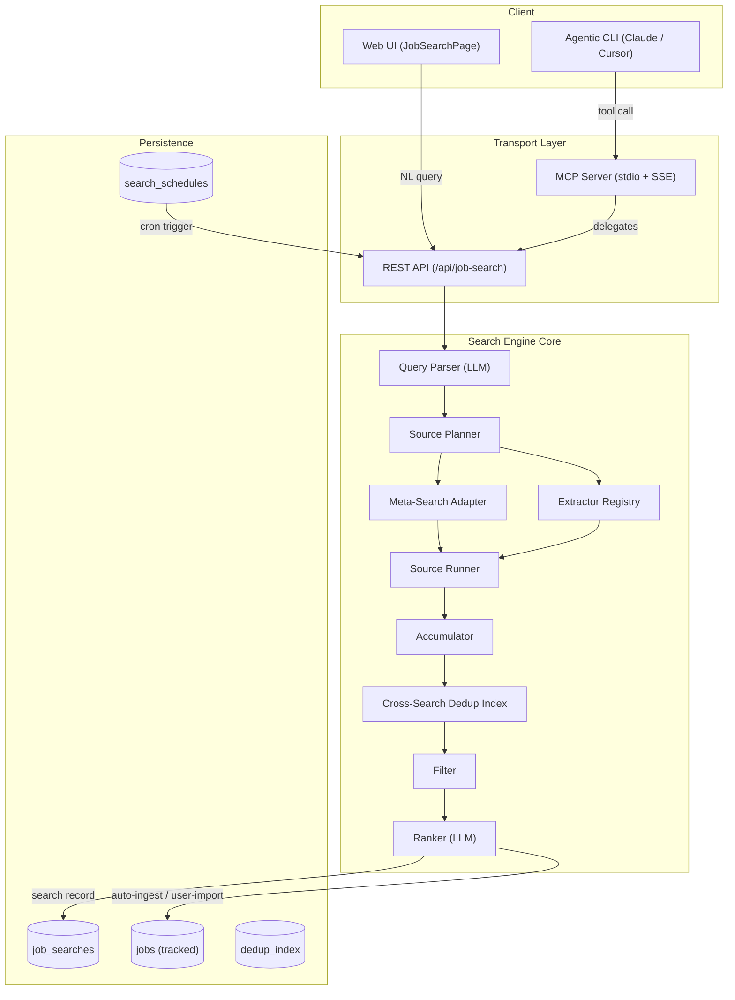
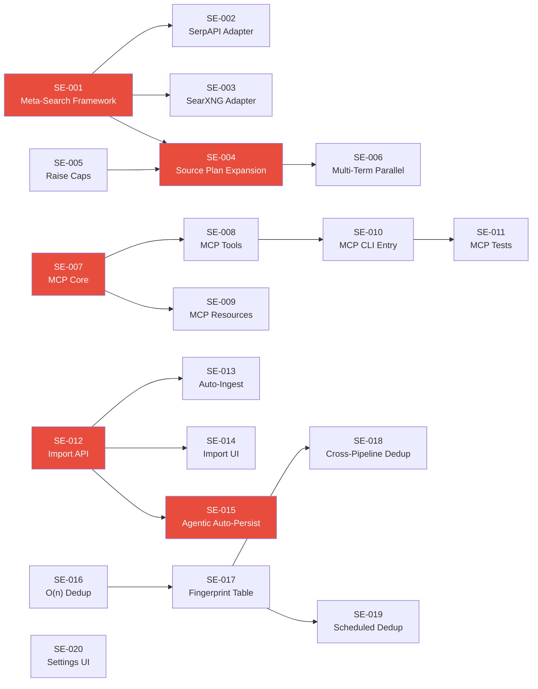

# ADR-008: Job Search Engine — Internet-Wide Crawl, MCP Integration, Job Persistence, & Dedup Optimization

> **Status**: Proposed  
> **Authors**: System Architect  
> **Created**: 2026-08-14  
> **Supersedes**: Portions of ADR-002 (job search), ADR-001 v2 (agentic search)

---

## Executive Summary

Four critical gaps in the current job search subsystem are addressed by this ADR:

1. **Shallow crawl coverage** — searches return minimal results because `buildSourcePlan` only invokes extractors whose manifests are registered *and* pass credential/country gates; no fallback expansion, no web-wide crawl, no SerpAPI/Google Jobs/aggregate API layer.
2. **No MCP server** — the orchestrator has no Model Context Protocol surface; external agentic CLIs (Claude Code, Cursor, OpenCode, etc.) cannot drive searches, read results, or trigger actions programmatically.
3. **Search results are ephemeral** — jobs returned by the search engine live only in `job_searches.results` JSON and are never inserted into the `jobs` table, so they never appear in the Tracked Jobs / Orchestrator tabs.
4. **Dedup is O(n²) and search-scoped only** — the `deduplicateJobs` function runs an inner loop per job; cross-search and cross-pipeline dedup relies on URL string matching alone; scheduled searches create duplicate discoveries.

---

## 1. Current-State Audit

### 1.1 Crawl Coverage

| Layer | File | Finding | Severity |
|---|---|---|---|
| Source catalog | [`shared/src/extractors/index.ts`](file:///Users/venkatasai/untitled%20folder/job-ops/shared/src/extractors/index.ts) | 56 source IDs declared, but only 24 have extractor directories; many major boards (Indeed, LinkedIn, Glassdoor, ZipRecruiter, Google Jobs, Dice, Monster) have catalog entries but **no runtime manifest** | **Critical** |
| Source plan | [`source-plan.ts`](file:///Users/venkatasai/untitled%20folder/job-ops/orchestrator/src/server/services/job-search/source-plan.ts) | Only schedules manifests that pass `credentialsAvailableForSource` + `isSourceAllowedForCountry`; with no API keys configured, most sources are skipped silently | High |
| Source runner | [`source-runner.ts`](file:///Users/venkatasai/untitled%20folder/job-ops/orchestrator/src/server/services/job-search/source-runner.ts#L164-L173) | `buildSearchTerms` falls back to `"software engineer"` when roles/skills are empty — a generic default that misses niche queries entirely | Medium |
| Resource limits | [`resource-limits.ts`](file:///Users/venkatasai/untitled%20folder/job-ops/orchestrator/src/server/services/job-search/resource-limits.ts#L130-L140) | `maxCandidates: 500`, `maxRankedCandidates: 100` — hard caps prevent large result sets even when sources return more | Medium |
| Agentic loop | [`agentic/orchestrator.ts`](file:///Users/venkatasai/untitled%20folder/job-ops/orchestrator/src/server/services/agentic/orchestrator.ts#L378-L605) | Iterative refinement re-runs the **same** registered manifests with expanded terms — never discovers new sources or APIs | High |

**Root cause**: The architecture assumes a closed, pre-registered set of extractors. There is no "meta-search" / aggregator layer that can query Google Jobs, SerpAPI, or SearXNG to discover results beyond the registered manifests.

### 1.2 MCP Integration

- **Zero MCP code exists** in the codebase (`grep -ri mcp orchestrator/src` → 0 results).
- The existing REST API in [`api/routes/`](file:///Users/venkatasai/untitled%20folder/job-ops/orchestrator/src/server/api/routes) provides CRUD and SSE but no JSON-RPC 2.0 or stdio transport.
- No `tools/` schema is published for external agents.

### 1.3 Ephemeral Results

- [`orchestrator.ts:290`](file:///Users/venkatasai/untitled%20folder/job-ops/orchestrator/src/server/services/job-search/orchestrator.ts#L287-L303) persists results to `job_searches.results` as a monolithic JSON blob.
- The `jobs` table ([`schema.ts:60-159`](file:///Users/venkatasai/untitled%20folder/job-ops/orchestrator/src/server/db/schema.ts#L60-L159)) is only populated by the **pipeline** (`discover-jobs.ts`), never by the search engine.
- [`JobSearchPage.tsx`](file:///Users/venkatasai/untitled%20folder/job-ops/orchestrator/src/client/pages/JobSearchPage.tsx) has no "Add to Tracked Jobs" affordance (confirmed: `grep -i track JobSearchPage.tsx` → 0 results).
- Agentic orchestrator saves a `job_searches` record at line 806 but **never writes individual jobs to the `jobs` table**.

### 1.4 Dedup & Scheduled Search

- [`dedup.ts`](file:///Users/venkatasai/untitled%20folder/job-ops/orchestrator/src/server/services/job-search/dedup.ts#L204-L236): O(n²) inner-loop scan; no index structures. At 2,000 jobs this is ~4M comparisons.
- Cross-search dedup is absent — two searches for the same query at different times produce duplicate `jobs` rows if ingested.
- Pipeline discover step uses `getAllJobUrls()` to skip known URLs, but the search engine **does not query the `jobs` table** before accumulating (line 152: `existingJobUrlsPromise: Promise.resolve([])`).
- Scheduled search ([`search-scheduler.ts`](file:///Users/venkatasai/untitled%20folder/job-ops/orchestrator/src/server/services/search-scheduler.ts)) runs `executeJobSearch` which also skips cross-pipeline dedup.

---

## 2. Architecture

### 2.1 High-Level Data Flow (Target State)



### 2.2 Meta-Search Adapter (New)

A new `meta-search` adapter sits alongside the extractor registry and queries aggregator APIs to fill gaps left by unregistered or credential-gated sources.

**Priority order** (first available wins):
1. **SerpAPI Google Jobs** — structured JSON, 100 results/call, pagination (`start` param)
2. **SearXNG self-hosted** — open-source meta-search, queries Google, Bing, DuckDuckGo simultaneously
3. **Brave Search API** — job-specific vertical in beta
4. **Bing Web Search API** — `site:indeed.com OR site:linkedin.com` scoped queries

**Adapter contract**:
```typescript
interface MetaSearchAdapter {
  readonly id: string;
  readonly displayName: string;
  available(): Promise<boolean>;
  search(params: MetaSearchParams): AsyncGenerator<CreateJobInput[], void>;
}

interface MetaSearchParams {
  terms: string[];
  location: { country: string | null; cities: string[] };
  workMode: 'remote' | 'hybrid' | 'onsite' | 'any';
  maxPages: number;
  timeoutMs: number;
}
```

**Key design decisions**:
- Adapters are *generators* yielding pages of results so the accumulator can emit provisional snapshots as pages arrive.
- A `metaSearchEnabled` setting (default `true`) and per-adapter env-var gates (`SERPAPI_KEY`, `SEARXNG_URL`, `BRAVE_SEARCH_KEY`) control availability.
- Meta-search results are deduplicated against extractor results in the accumulator — they are never a separate "source" from the user's perspective.

### 2.3 MCP Server

Implements the [Model Context Protocol specification](https://spec.modelcontextprotocol.io/) as a standalone entry point alongside the Express server.

**Transport**: stdio (for CLI integration) + HTTP SSE (for web agent integration).

**Exposed tools**:

| Tool | Description | Parameters |
|---|---|---|
| `search_jobs` | Run a full job search | `{ query: string, fresh?: boolean }` |
| `get_search_status` | Poll search status/results | `{ searchId: string }` |
| `list_recent_searches` | List recent search history | `{ limit?: number }` |
| `import_search_jobs` | Import search results to tracked jobs | `{ searchId: string, jobUrls?: string[], mode: 'all'\|'selected' }` |
| `get_tracked_jobs` | List tracked/discovered jobs | `{ status?: string, limit?: number }` |
| `get_job_details` | Get full job details | `{ jobId: string }` |
| `update_job_status` | Change job application status | `{ jobId: string, status: string }` |
| `run_pipeline` | Trigger the discovery pipeline | `{}` |
| `get_settings` | Read app settings | `{ keys?: string[] }` |
| `update_settings` | Write app settings | `{ settings: Record<string, string> }` |

**Resources** (read-only context):
- `jobops://profile` — current resume profile
- `jobops://settings` — current settings snapshot
- `jobops://stats` — dashboard statistics

**Self-healing**:
- Heartbeat via MCP `ping` — auto-reconnect on 3 consecutive missed pongs.
- Request timeout (30s default) with graceful cancellation propagation.
- Structured error codes mapped to MCP error schema.

### 2.4 Job Persistence Bridge (Search → Tracked)

**Auto-ingest mode** (configurable via `searchAutoIngestEnabled` setting, default `false`):
When enabled, the search engine automatically inserts highly-relevant results (relevance ≥ 70) into the `jobs` table with `status: 'discovered'` and `discoveredByRunId` set to the search ID.

**Manual import** (always available):
- New API endpoint: `POST /api/job-search/:id/import`
- New UI action: "Import to Tracked Jobs" button per result + bulk "Import All" on search results page.
- Client-side: per-job "Track" button on each `JobSearchResultItem` card.

**Dedup on ingest**:
Before inserting, the system queries the `jobs` table for matching `jobUrl` (normalized) or `sourceJobId + source`. If a match exists, the job is silently skipped (with a merge of any richer metadata).

### 2.5 Optimized Dedup

**Replace O(n²) scan with indexed lookup**:

```typescript
// New: Map-based dedup index with multiple keys per job
class DedupIndex {
  private bySourceId = new Map<string, number>();  // "source:sourceJobId" → canonical index
  private byUrl = new Map<string, number>();        // normalized URL → canonical index
  private byAppUrl = new Map<string, number>();     // normalized application URL → canonical index
  private byContent = new Map<string, number>();    // "employer|title|location" → canonical index

  has(keys: DedupKey): number | null;  // O(1) lookup across all maps
  add(keys: DedupKey, index: number): void;
}
```

This reduces dedup from O(n²) to O(n) amortized. Fuzzy title matching (Levenshtein) is applied as a secondary pass only when the deterministic keys don't match — scoped to same-employer candidates via an employer→index multimap.

**Cross-search dedup**:
A new `dedup_fingerprints` table stores content fingerprints from completed searches:

```sql
CREATE TABLE dedup_fingerprints (
  fingerprint TEXT PRIMARY KEY,     -- sha256(employer|title|location)
  canonical_job_url TEXT NOT NULL,
  first_seen_at TEXT NOT NULL,
  last_seen_at TEXT NOT NULL
);
```

New searches consult this table before accumulating, and the scheduled-search path writes fingerprints after completion.

---

## 3. Detailed Tickets

### Epic 1: Internet-Wide Crawl Coverage

#### SE-001: Meta-Search Adapter Framework
**Type**: Feature | **Priority**: P0 | **Estimate**: L

**Files to create**:
- `orchestrator/src/server/services/job-search/meta-search/types.ts` — `MetaSearchAdapter`, `MetaSearchParams`, `MetaSearchResult` interfaces
- `orchestrator/src/server/services/job-search/meta-search/index.ts` — adapter registry, priority-based selection
- `orchestrator/src/server/services/job-search/meta-search/registry.ts` — `getAvailableMetaAdapters()`, caches adapter availability

**Acceptance criteria**:
- Adapter interface is generic and testable with a mock adapter
- At least one concrete adapter is functional (SE-002 or SE-003)
- Source plan integrates meta-search as a fallback when registered extractors cover < 3 sources

---

#### SE-002: SerpAPI Google Jobs Adapter
**Type**: Feature | **Priority**: P0 | **Estimate**: M

**Files to create**:
- `orchestrator/src/server/services/job-search/meta-search/serpapi.ts`
- `orchestrator/src/server/services/job-search/meta-search/serpapi.test.ts`

**Behavior**:
- Calls `serpapi.com/search.json?engine=google_jobs` with NL-derived structured params
- Paginate via `start` param (0, 10, 20, …) up to `maxPages` (default 5 = 50 results)
- Map SerpAPI `jobs_results` schema → `CreateJobInput`
- Yield pages as generator so accumulator can stream partial results
- Gated by `SERPAPI_KEY` env var

**Settings**:
- `serpApiKey` (setting, fallback to `SERPAPI_KEY` env)
- `serpApiMaxPages` (default `5`)

---

#### SE-003: SearXNG Self-Hosted Adapter
**Type**: Feature | **Priority**: P1 | **Estimate**: M

**Files to create**:
- `orchestrator/src/server/services/job-search/meta-search/searxng.ts`
- `orchestrator/src/server/services/job-search/meta-search/searxng.test.ts`

**Behavior**:
- Queries `SEARXNG_URL/search?q=...&categories=general&engines=google,bing,duckduckgo&format=json`
- Constructs job-focused queries: `"<role>" jobs in <location> site:indeed.com OR site:linkedin.com OR site:glassdoor.com`
- LLM-powered result extraction: SearXNG returns web results, not structured jobs. An LLM call extracts job fields from title + snippet + URL.
- Gated by `SEARXNG_URL` env var

---

#### SE-004: Source Plan Expansion — Meta-Search Fallback
**Type**: Feature | **Priority**: P0 | **Estimate**: M

**Files to modify**:
- [`source-plan.ts`](file:///Users/venkatasai/untitled%20folder/job-ops/orchestrator/src/server/services/job-search/source-plan.ts) — add meta-search tasks when registered extractor coverage < threshold
- [`resource-limits.ts`](file:///Users/venkatasai/untitled%20folder/job-ops/orchestrator/src/server/services/job-search/resource-limits.ts) — add `MANIFEST_CAPABILITIES` entries for meta-search adapters
- [`source-runner.ts`](file:///Users/venkatasai/untitled%20folder/job-ops/orchestrator/src/server/services/job-search/source-runner.ts) — handle meta-search adapter dispatch alongside manifest dispatch

**Logic**:
```
if (registeredTasks.length < MIN_SOURCE_COVERAGE) {
  const metaAdapters = await getAvailableMetaAdapters();
  for (const adapter of metaAdapters) {
    tasks.push(createMetaSearchTask(adapter, spec));
  }
}
```
`MIN_SOURCE_COVERAGE` default: `3`. When fewer than 3 registered extractors can run, meta-search fills the gap.

---

#### SE-005: Raise Default Candidate & Ranking Caps
**Type**: Config | **Priority**: P1 | **Estimate**: S

**Files to modify**:
- [`resource-limits.ts`](file:///Users/venkatasai/untitled%20folder/job-ops/orchestrator/src/server/services/job-search/resource-limits.ts#L130-L140)

**Changes**:
- `maxCandidates`: 500 → 2000
- `maxRankedCandidates`: 100 → 300
- `sourceConcurrency` default: 2 → 4
- `sourceTimeoutMs` default: 120s → 180s
- Add `metaSearchTimeoutMs`: 60s default

---

#### SE-006: Parallel Multi-Term Search Strategy
**Type**: Feature | **Priority**: P1 | **Estimate**: M

**Files to modify**:
- [`source-runner.ts`](file:///Users/venkatasai/untitled%20folder/job-ops/orchestrator/src/server/services/job-search/source-runner.ts#L164-L173)

**Current**: `buildSearchTerms` concatenates roles + skills into a single terms array. Each manifest gets invoked once.

**Target**: When roles > 1, clone the task per role and run them in parallel (bounded by `sourceConcurrency`). This multiplies coverage for multi-role queries like "data engineer or ML engineer."

---

### Epic 2: MCP Server / Client Integration

#### SE-007: MCP Server Core — Transport & Lifecycle
**Type**: Feature | **Priority**: P0 | **Estimate**: L

**Files to create**:
- `orchestrator/src/server/mcp/index.ts` — entry point, stdio + SSE transport setup
- `orchestrator/src/server/mcp/transport-stdio.ts` — stdin/stdout JSON-RPC 2.0 framing
- `orchestrator/src/server/mcp/transport-sse.ts` — HTTP SSE transport for web agents
- `orchestrator/src/server/mcp/server.ts` — MCP `Server` class, tool/resource registration
- `orchestrator/src/server/mcp/types.ts` — MCP protocol types
- `orchestrator/src/server/mcp/health.ts` — ping/pong heartbeat, reconnect logic

**Dependencies**: `@modelcontextprotocol/sdk` (official MCP SDK)

**Self-healing**:
- Stdio transport: process-level signal handlers for SIGTERM/SIGINT graceful shutdown
- SSE transport: heartbeat every 15s; 3 missed → close + client retry with backoff
- All tool calls wrapped in try/catch → MCP error response, never crashes the server
- Request timeout: 30s default, configurable via `mcpRequestTimeoutMs` setting

---

#### SE-008: MCP Tools — Job Search Operations
**Type**: Feature | **Priority**: P0 | **Estimate**: M

**Files to create**:
- `orchestrator/src/server/mcp/tools/search.ts` — `search_jobs`, `get_search_status`, `list_recent_searches`
- `orchestrator/src/server/mcp/tools/jobs.ts` — `get_tracked_jobs`, `get_job_details`, `update_job_status`, `import_search_jobs`
- `orchestrator/src/server/mcp/tools/pipeline.ts` — `run_pipeline`
- `orchestrator/src/server/mcp/tools/settings.ts` — `get_settings`, `update_settings`

Each tool delegates to existing service-layer functions. No business logic in the MCP layer.

---

#### SE-009: MCP Resources — Read-Only Context
**Type**: Feature | **Priority**: P2 | **Estimate**: S

**Files to create**:
- `orchestrator/src/server/mcp/resources.ts` — `jobops://profile`, `jobops://settings`, `jobops://stats`

Resources provide context to the agent without requiring tool calls.

---

#### SE-010: MCP CLI Entry Point & npm Script
**Type**: Feature | **Priority**: P1 | **Estimate**: S

**Files to create/modify**:
- `orchestrator/src/server/mcp/cli.ts` — standalone entry point for `node dist/mcp/cli.js`
- `orchestrator/package.json` — add `"mcp": "tsx src/server/mcp/cli.ts"` script

**Usage**:
```jsonc
// Claude Code / Cursor MCP config
{
  "mcpServers": {
    "jobops": {
      "command": "npm",
      "args": ["--workspace", "orchestrator", "run", "mcp"],
      "cwd": "/path/to/job-ops"
    }
  }
}
```

---

#### SE-011: MCP Integration Tests
**Type**: Test | **Priority**: P1 | **Estimate**: M

**Files to create**:
- `orchestrator/src/server/mcp/server.test.ts`
- `orchestrator/src/server/mcp/tools/search.test.ts`
- `orchestrator/src/server/mcp/tools/jobs.test.ts`

Tests use the MCP SDK's `InMemoryTransport` to exercise the full request → tool → response cycle without stdio.

---

### Epic 3: Search → Tracked Jobs Persistence

#### SE-012: Job Import API Endpoint
**Type**: Feature | **Priority**: P0 | **Estimate**: M

**Files to create/modify**:
- `orchestrator/src/server/api/routes/job-search.ts` — add `POST /api/job-search/:id/import`
- `orchestrator/src/server/services/job-search/import.ts` — `importSearchJobsToTracked(searchId, options)`

**Endpoint contract**:
```
POST /api/job-search/:id/import
Body: { mode: 'all' | 'selected' | 'above_threshold', jobUrls?: string[], minRelevance?: number }
Response: { ok: true, data: { imported: number, skipped: number, duplicates: number } }
```

**Import logic**:
1. Load search results from `job_searches.results`
2. For each job in scope:
   a. Normalize URL, check `jobs` table for existing match → skip if found
   b. Map `JobSearchResultItem.job` → `jobs` table insert
   c. Set `status: 'discovered'`, `discoveredByRunId: searchId`
   d. Write `dedup_fingerprints` entry
3. Return import summary

---

#### SE-013: Auto-Ingest Setting & Post-Search Hook
**Type**: Feature | **Priority**: P1 | **Estimate**: M

**Files to modify**:
- [`orchestrator.ts`](file:///Users/venkatasai/untitled%20folder/job-ops/orchestrator/src/server/services/job-search/orchestrator.ts#L287-L303) (search orchestrator) — call `importSearchJobsToTracked` after ranking when `searchAutoIngestEnabled` is true
- [`agentic/orchestrator.ts`](file:///Users/venkatasai/untitled%20folder/job-ops/orchestrator/src/server/services/agentic/orchestrator.ts#L790-L849) — same hook after agentic search completes
- Settings repo — add `searchAutoIngestEnabled` (default `false`) and `searchAutoIngestMinRelevance` (default `70`)

---

#### SE-014: Client-Side Import UI
**Type**: Feature | **Priority**: P0 | **Estimate**: M

**Files to modify**:
- [`JobSearchPage.tsx`](file:///Users/venkatasai/untitled%20folder/job-ops/orchestrator/src/client/pages/JobSearchPage.tsx) — add "Track" button per job card, "Import All" bulk action, import status toast

**UX**:
- Per-job: small "Track" icon button → calls `POST /api/job-search/:id/import` with `mode: 'selected', jobUrls: [url]`
- Bulk: "Import All Matching" button in results header → calls with `mode: 'above_threshold', minRelevance: 70`
- Visual indicator: jobs already in tracked list show "Already Tracked" badge (compare against `jobs` table via a new `GET /api/jobs/urls` endpoint)

---

#### SE-015: Agentic Orchestrator — Auto-Persist to Jobs Table
**Type**: Bug | **Priority**: P0 | **Estimate**: S

**Files to modify**:
- [`agentic/orchestrator.ts`](file:///Users/venkatasai/untitled%20folder/job-ops/orchestrator/src/server/services/agentic/orchestrator.ts#L804-L849) — after saving `job_searches` record at line 806, also insert individual jobs into `jobs` table using the same import logic from SE-012

**Current behavior**: Saves a `job_searches` row with results JSON but never writes to `jobs`.
**Target behavior**: All highly-relevant results (relevance ≥ `searchAutoIngestMinRelevance`) are auto-inserted into `jobs` with `status: 'discovered'`.

---

### Epic 4: Dedup Optimization & Scheduled Search

#### SE-016: O(n) Indexed Dedup
**Type**: Performance | **Priority**: P1 | **Estimate**: M

**Files to modify**:
- [`dedup.ts`](file:///Users/venkatasai/untitled%20folder/job-ops/orchestrator/src/server/services/job-search/dedup.ts)

**Changes**:
- Replace the O(n²) inner loop with `DedupIndex` (Map-based, 4 keys per job)
- Fuzzy title matching runs only for same-employer candidates (scoped by `byEmployer` multimap)
- Benchmark: current 2000-job dedup takes ~400ms; target: < 50ms

**Test changes**:
- [`dedup.test.ts`](file:///Users/venkatasai/untitled%20folder/job-ops/orchestrator/src/server/services/job-search/dedup.test.ts) — add benchmark test, verify identical dedup behavior with indexed version

---

#### SE-017: Cross-Search Dedup Fingerprint Table
**Type**: Feature | **Priority**: P1 | **Estimate**: M

**Files to create/modify**:
- [`schema.ts`](file:///Users/venkatasai/untitled%20folder/job-ops/orchestrator/src/server/db/schema.ts) — add `dedup_fingerprints` table
- [`migrate.ts`](file:///Users/venkatasai/untitled%20folder/job-ops/orchestrator/src/server/db/migrate.ts) — migration for new table
- `orchestrator/src/server/repositories/dedup-fingerprints.ts` — CRUD for fingerprints
- Modify [`accumulator.ts`](file:///Users/venkatasai/untitled%20folder/job-ops/orchestrator/src/server/services/job-search/accumulator.ts) — query fingerprint table before ingesting, write after final report

---

#### SE-018: Cross-Pipeline Dedup (Search ↔ Pipeline)
**Type**: Feature | **Priority**: P1 | **Estimate**: M

**Files to modify**:
- [`orchestrator.ts`](file:///Users/venkatasai/untitled%20folder/job-ops/orchestrator/src/server/services/job-search/orchestrator.ts#L152) — replace `Promise.resolve([])` with actual `getAllJobUrls()` call
- [`agentic/orchestrator.ts`](file:///Users/venkatasai/untitled%20folder/job-ops/orchestrator/src/server/services/agentic/orchestrator.ts#L427) — already calls `getAllJobUrls()` but results are used for source-level skip, not for accumulator-level dedup. Wire the URL set into the accumulator.

**Current bug**: Line 152 of the search orchestrator hardcodes `existingJobUrlsPromise: Promise.resolve([])`, which means search results are **never** deduped against existing tracked jobs.

---

#### SE-019: Scheduled Search — Dedup Against Prior Runs
**Type**: Feature | **Priority**: P1 | **Estimate**: M

**Files to modify**:
- [`search-scheduler.ts`](file:///Users/venkatasai/untitled%20folder/job-ops/orchestrator/src/server/services/search-scheduler.ts#L86-L106) — after `executeJobSearch`, compare results against the previous run's results for the same schedule and suppress already-seen jobs in notifications
- [`search-notifications.ts`](file:///Users/venkatasai/untitled%20folder/job-ops/orchestrator/src/server/services/search-notifications.ts) — add `newJobsOnly` filter using `dedup_fingerprints` table

---

#### SE-020: Settings UI — Search Engine Configuration
**Type**: Feature | **Priority**: P2 | **Estimate**: M

**Files to modify**:
- [`SettingsPage.tsx`](file:///Users/venkatasai/untitled%20folder/job-ops/orchestrator/src/client/pages/SettingsPage.tsx) — add "Search Engine" section with:
  - `serpApiKey` input (masked)
  - `searxngUrl` input
  - `searchAutoIngestEnabled` toggle
  - `searchAutoIngestMinRelevance` slider (0-100)
  - `metaSearchEnabled` toggle
  - `mcpEnabled` toggle
- [`settings.ts`](file:///Users/venkatasai/untitled%20folder/job-ops/orchestrator/src/server/services/settings.ts) — register new setting keys

---

## 4. Dependency Graph & Execution Order



**Phase 1 (P0 — unblock core value)**: SE-001, SE-002, SE-004, SE-005, SE-012, SE-014, SE-015  
**Phase 2 (P0 — MCP)**: SE-007, SE-008, SE-010  
**Phase 3 (P1 — dedup & quality)**: SE-016, SE-017, SE-018, SE-006, SE-013  
**Phase 4 (P1-P2 — polish)**: SE-003, SE-009, SE-011, SE-019, SE-020

---

## 5. Adversarial Review

### 5.1 What Could Go Wrong

| Risk | Mitigation |
|---|---|
| SerpAPI rate limits / cost | Per-search budget cap (`serpApiMaxPages`); LRU cache keyed by normalized query + location (5-minute TTL). Daily cost alert via setting |
| Meta-search returns garbage (irrelevant URLs) | All results pass through the same filter + LLM ranking pipeline — irrelevant jobs score < 30 and sort to the bottom |
| MCP server crash takes down the web app | MCP runs as a separate process (stdio) or isolated Express sub-router (SSE); never shares the main event loop for stdio mode |
| Auto-ingest floods the `jobs` table | Relevance threshold (default 70), daily cap setting (`searchAutoIngestMaxPerDay`, default 200), dedup prevents re-insertion |
| Cross-search dedup fingerprint table grows unbounded | TTL-based cleanup: fingerprints older than 90 days are purged by a daily cron |
| O(n) dedup index uses too much memory | At 10K jobs × 4 keys × ~100 bytes/key = ~4MB — negligible. Map GC is handled normally |
| Fuzzy title matching still slow for large corpora | Scoped to same-employer candidates only; employer multimap ensures we never Levenshtein-compare across different companies |

### 5.2 What We're NOT Doing (and Why)

- **Not building a custom web crawler** — too fragile, anti-bot arms race. Meta-search APIs provide structured data with better reliability.
- **Not storing raw HTML** — we only persist structured `CreateJobInput` records; no PII-heavy HTML blobs in the DB.
- **Not exposing MCP over WebSocket** — the MCP spec standardizes on stdio + SSE; WS would be a non-standard extension with no client support.
- **Not replacing the extractor registry** — existing extractors (24 of them) work well for their domains. Meta-search is additive, not a replacement.

---

## 6. Verification Plan

### Automated Tests
```bash
# Unit tests for new modules
npm --workspace orchestrator run test:run -- --grep "meta-search|dedup-index|import|mcp"

# Full CI parity
./orchestrator/node_modules/.bin/biome ci .
npm run check:types:shared
npm --workspace orchestrator run check:types
npm --workspace orchestrator run build:client
npm --workspace orchestrator run test:run
```

### Manual Verification
1. Run a search for "ML engineer in Toronto" — verify results come from both registered extractors AND meta-search
2. Click "Import All" — verify jobs appear in Tracked Jobs tab
3. Run the same search again — verify cross-search dedup suppresses duplicates
4. Configure MCP in Claude Code — verify `search_jobs` tool returns results
5. Enable a search schedule — verify cron run deduplicates against prior runs

---

## 7. Glossary

| Term | Definition |
|---|---|
| **Meta-search adapter** | A connector that queries an external search aggregator (SerpAPI, SearXNG, Brave) to discover jobs beyond registered extractors |
| **MCP** | Model Context Protocol — a standard for connecting AI agents to external tools via JSON-RPC 2.0 |
| **Dedup fingerprint** | SHA-256 hash of `normalized(employer) + normalized(title) + normalized(location)`, stored for cross-search dedup |
| **Auto-ingest** | Automatic insertion of high-relevance search results into the tracked `jobs` table |
| **Source plan** | The manifest execution plan built per search, determining which extractors and meta-search adapters to invoke |
